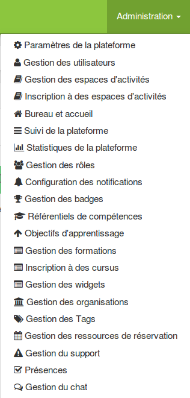

## Paramétrer la plateforme

---

Lorsqu'on est connecté avec le statut d'administrateur à la plateforme, l'onglet **Administration** apparaît en haut de page dans la barre de menu supérieure. Il permet d'accéder aux réglages de la plateforme.

### La barre d'outils d'administration

Lorsque l'espace d'administration est activé, la barre d'outils à gauche de la page est également disponible.

La barre d'outils latérale s'enrichit de plusieurs commandes.

### Aperçu de ce que vous pouvez réaliser en tant qu'administrateur.

<table>
  <tbody>
    <tr>
      <th>Outils du menu</th>
      <th>Ce que les outils permettent</th>
    </tr>
    <tr>
      <td><b>Paramètres de la plateforme</b></td>
      <td>Accéder aux paramètres du panneau d'administration</td>
    </tr>
    <tr>
      <td><b>Gestion des utilisateurs</b></td>
      <td>Ajouter des utilisateurs, gérer des groupes et des profils. Les utilisateurs peuvent être ajoutés par lots avec un fichier csv, ou individuellement.</td>
    </tr>
    <tr>
      <td><b>Gestion des espaces d'activités</b></td>
      <td>Créer, supprimer, modifier, rendre visible un espace d'activités, autoriser ou non l'inscription publique.</td>
    </tr>
    <tr>
      <td><b>Inscription à des espaces d'activités</b></td>
      <td>Inscrire des utilisateurs ou des groupes à des espaces d'activités. Il convient au préalable cocher l'espace d'activités concerné pour rendre actifs les boutons <b>Inscrire des utilisateurs</b> ou <b>Inscrire des groupes</b>.</td>
    </tr>
    <tr>
      <td><b>Paquets de la plateforme</b></td>
      <td>Permet d'afficher les paquets du noyaux et des plugins installés. "Actualiser" permet de rechercher si des versions plus récentes des paquets existent. Le numéro de la version du paquet est affiché en bleu près de son nom. Si une version plus récente existe, elle est mentionnée dans un encadré en couleur rouge **Mise à jour disponible**. Il conviendra alors de mettre à jour la plateforme.</td>
    </tr>
   <tr>
      <td><b>Onglets de la page d'accueil</b></td>
      <td>Permet de configurer la structure par défaut du bureau d'accueil de chaque membre (onglets, widgets).</td>
    </tr>
    <tr>
      <td><b>Outils du bureau</b></td>
      <td>Permet de renommer chaque élément de la barre d'outils pour personnaliser la plateforme selon ses besoins. Les termes à personnaliser sont:  Accueil - Paramètres - Ressources - Agenda - Suivi - Tableau de bord - Utilisateurs - Badges - Mes badges - Mes activités - Ma banque de questions - Parcours.</td>
    </tr>
    <tr>
      <td><b>Suivi de la plateforme</b></td>
      <td></td>
    </tr>
    <tr>
      <td><b>Statistiques de la plateforme</b></td>
      <td></td>
    </tr>
    <tr>
      <td><b>Gestion des rôles</b></td>
      <td></td>
    </tr>
    <tr>
      <td><b>Configuration des notifications</b></td>
      <td></td>
    </tr>
    <tr>
      <td><b>Gestion des badges</b></td>
      <td></td>
    </tr>
    <tr>
      <td><b>Référentiel de compétences</b></td>
      <td></td>
    </tr>
    <tr>
      <td><b>Objectifs d'apprentissage</b>
        <ul>
          <li>item1</li>
          <li>item2</li>
        </ul>
      </td>
      <td align="center">See the list</td>
    </tr>
  </tbody>
</table>

| Outils du menu | Ce que les outils permettent |
| -- | -- |
| **Onglets de la page d'accueil** |  |
| **** |  |
| **** | Indique le nombre d'actions par jour et la liste des actions (horodatées) effectuées par les utilisateurs. |
| **** | Il s'agit d'un outil statistique plus complet qui présente des vues d'ensemble:<ul><li>Un diagramme mesurant les activités des 30 derniers jours</li><li>Un diagramme circulaire présentant la répartition des membres par profil</li><li>Les contenus les plus consultés.</li></ul> L'onglet "Audience" propose un diagramme des visites des utilisateurs. L'onglet "Contenu de la plateforme" présente un diagramme circulaire indiquant la répartition des ressources par type. Un onglet "Top des activités" permet de connaître les activités et ressources les plus consultées, mais aussi les membres les plus actifs sur la plateforme.|
| **** | Permet de configurer: la liste des rôles : permet de créer un nouveau rôle et de définir un nombre limite d'utilisateurs par rôle. La gestion des outils : Un tableau propose pour le profil "Utilisateur" et "Créateur d'espace" une liste d'outils à cocher. |
| **** | Permet de paramétrer les notifications par page et l'historique. |
| **** | Créer des badges pour motiver les utilisateurs. |
| **Référentiel de compétences** | Il s'agit de créer un référentiel de compétences. |
| **** | Permet de définir les objectifs d'apprentissage de chaque utilisateur. L'objectif d'apprentissage est un ensemble de compétences. |

 	

 	
 	
 	
 	
