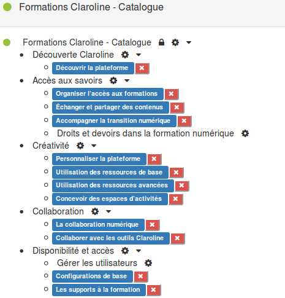

#### Organiser des formations

---

Au sein de la plateforme, les formations vont se structurer en partant d'un niveau trés général et abstrait (le cursus) vers des éléments de plus en plus précis pour aboutir finalement à des séances. La manière dont vous aller apréhender et utiliser l'outil va induire l'organisation de votre plateforme.

Avant de rentrer du l'utilisation concrète du gestionnaire de formations, il est intéressant de faire un petit point lexicale, car si certains mots que nous utilisons au sein de la plateforme sont les mêmes que dans votre organisme, ils ne recouvrent pas nécessairement le même sens.

* **Cursus:**

Il s'agit du squelette de votre catalogue de formations, de votre programme. Il permet de hiérarchiser, regrouper ou au contraire isoler vos formations. Cette structure vous permettra de gérer les inscriptions par "groupes de formations".

* **Formations:**

Il s'agit de l'élément central du cursus. Les formations sont les "activités" que vous organisez dans votre établissement. Dans l'enseignement ce qu'on nommerait "cours". Néanmoins, à ce niveau nous sommes toujours dans la dimension de ce que votre institution "peut" organiser. Nous sommes pas encore dans l'organisation concrète et réelle d'une moment de formation. Concrètement en terme de données, il s'agit ici simplement d'un intitulé et d'un descriptif.

Les éléments en noir correspondent au "cursus".

Les éléments en bleu sont des formations.

* **Sessions:**

A ce niveau-ci nous rentrons réellement dans le concret, il ne s'agit plus simplement d'un intitulé de formation qui peut être organisé, mais nous sommes dans l'opérationnalisation. Une session est forcement liée à une formations et elle permet de préciser la période durant laquelle se déroule cette formation, qui sont les participants et qui sont les formateurs. C'est également à ce niveau-ci que vont être générés ou liés [les espaces d'activités](workspaces/wksp.md). Il possible d'organiser de nombreuses sessions pour une même formation, tant l'une après l'autre qu'en simultané.

* **Séance:**

Les séances sont des évènements organisés durant une session. Là où la session définit une période plus ou moins longue, la séance indique un moment et un lieu précis. Typiquement il peut s'agir de l'organisation d'un moment en présentiel ou d'un rendez-vous sous forme de wébinaire. A travers l'utilisation des séances, la plateforme peut construire pour chaque apprenant ou chaque formateur son horaire personnalisé. 

