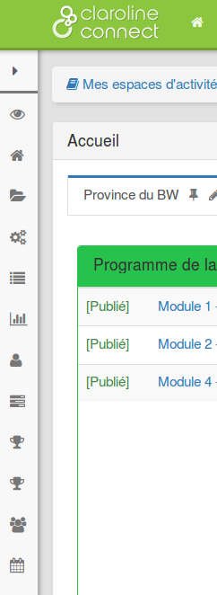
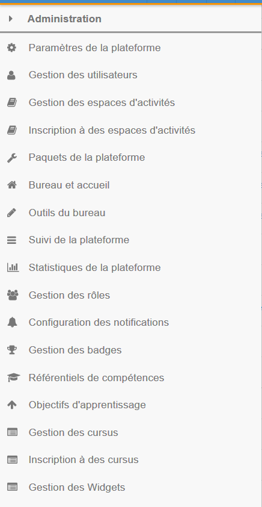

## Paramétrer la plateforme

---

Lorsqu'on est connecté avec le statut d'administrateur à la plateforme, l'onglet **Administration** apparaît en haut de page dans la barre de menu supérieure. Il permet d'accéder aux réglages de la plateforme.

### La barre d'outils d'administration

Lorsque l'espace d'administration est activé, la barre d'outils à gauche de la page est également disponible.

La barre latérale d'outils s'enrichit de plusieurs commandes.

### Aperçu de ce que vous pouvez réaliser en tant qu'administrateur.

| Outils du menu | Ce que les outils permettent |
| -- | -- |
| Paramètres de la plateforme | Accéder aux paramètres du panneau d'administration |
| 0:3 | 1:3 |
| 0:4 | 1:4 |
| 0:5 | 1:5 |
| 0:6 | 1:6 |
| 0:7 | 1:7 |
| 0:8 | 1:8 |
| 0:9 | 1:9 |
| 0:10 | 1:10 |
| 0:11 | 1:11 |
| 0:12 | 1:12 |
| 0:13 | 1:13 |
| 0:14 | 1:14 |
| Objectifs d'apprentissage | Permet de définir les objectifs d'apprentissage de chaque utilisateur. L'objectif d'apprentissage est un ensemble de compétences. |

Gestion des utilisateurs 	Ajouter des utilisateurs, gérer des groupes et des profils.
Les utilisateurs peuvent être ajoutés par lots avec un fichier csv, ou individuellement.
Gestion des espaces d'activités 	Créer, supprimer, modifier, rendre visible un espace d'activités, autoriser ou non l'inscription publique.
Inscription à des espaces d'activités 	Inscrire des utilisateurs ou des groupes à des espaces d'activités. Il convient au préalable cocher l'espace d'activités concerné pour rendre actifs les boutons "Inscrire des utilisateurs" ou "Inscrire des groupes".
Paquets de la plateforme 	Permet d'afficher les paquets du noyaux et des plugins installés. "Actualiser" permet de rechercher si des versions plus récentes des paquets existent. Le numéro de la version du paquet est affiché en bleu près de son nom. Si une version plus récente existe, elle est mentionnée dans un encadré en couleur rouge "Mise à jour disponible". Il conviendra alors de mettre à jour la plateforme.
Onglets de la page d'accueil 	Permet de configurer la structure par défaut du bureau d'accueil de chaque membre (onglets, widgets).
Outils du bureau 	Permet de renommer chaque élément de la barre d'outils pour personnaliser la plateforme selon ses besoins. Les termes à personnaliser sont : Accueil - Paramètres - Ressources - Agenda - Suivi - Tableau de bord - Utilisateurs - Badges - Mes badges - Mes activités - Ma banque de questions - Parcours.
Suivi de la plateforme 	Indique le nombre d'actions par jour et la liste des actions (horodatées) effectuées par les utilisateurs.
Statistiques de la plateforme 	Il s'agit d'un outil statistique plus complet qui présente des vues d'ensemble:

    Un diagramme mesurant les activités des 30 derniers jours
    Un diagramme circulaire présentant la répartition des membres par profils
    Les contenus les plus consultés

L'onglet "Audience" propose un diagramme des visites des utilisateurs ;
L'onglet "Contenu de la plateforme" présente un diagramme circulaire indiquant la répartition des ressources par type;
Enfin, un onglet "Top des activités" permet de connaître les activités et ressources les plus consultées, mais aussi les membres les plus actifs sur la plateforme.
Gestion des rôles 	Permet de configurer:

    la liste des rôles : permet de créer un nouveau rôle et de définir un nombre limite d'utilisateurs par rôle.
    la gestion des outils : Un tableau propose pour le profil "Utilisateur" et "Créateur d'espace" une liste d'outils à cocher.

Configuration des notifications 	Permet de paramétrer les notifications par page et l'historique.
Gestion des badges 	Créer des badges pour motiver les utilisateurs.
Référentiel de compétences 	Il s'agit de créer un référentiel de compétences.
 	
