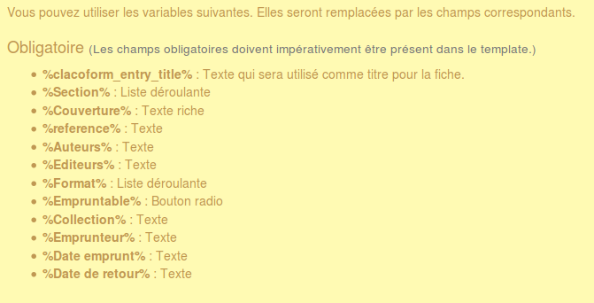

## Création d'un template

---

Maintenant que vous avez créé des champs, vous souhaitez peut-être organiser la mise en page de votre formulaire.

Cette étape n'est pas obligatoire. Si vous ne le faites pas, vos champs seront simplement affichés les uns à la suite des autres.

En cliquant sur le menu "Gestion des templates" vous arrivez sur une page séparée en deux écrans.

Le premier écran \(jaune\) vous propose une liste comprenant l'ensemble des champs que vous avez créés.

Vous constaterez rapidement deux choses:

* Le nom de chaque champ est entouré par le symbole "%". Il s'agit en fait de balises. Vous pouvez les positionner où vous le souhaitez dans le second écran. Cette balise sera remplacée par le champ en question lors de l'affichage du formulaire.

* La présence d'une balise %clacoform\_entry\_title% malgré que vous n'ayez créé aucun champ de ce genre. En effet, il s'agit d'un champ automatique et obligatoire qui correspond au titre de la fiche.

Le second écran est [l'éditeur de la plateforme](/fr/resources/text-editor.md).

C'est dans cet éditeur que vous allez pouvoir placer vos balises. Vous pouvez utiliser toutes les autres fonctions de l'éditeur pour ajouter des illustrations, du texte, des tableaux...

> Les champs que vous avez indiqués comme obligatoires lors de leur création **DOIVENT** être mis dans le template.
>
> Les champs indiqués comme étant des "données confidentielles" doivent être ajoutés dans le template. Ils seront remplissables à la création d'une fiche mais ne seront consultables par la suite que pour les rôles autorisés.

