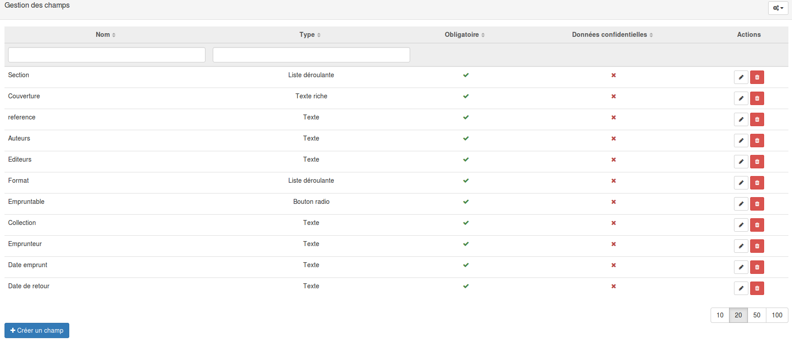
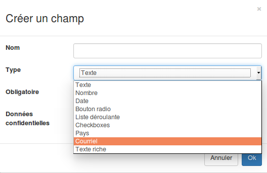

### Mise en place d'un formulaire
---
La première étape consiste à vous rendre d'un espace d'activités, dans la partie ressource. Il vous suffit ensuite de cliquer sur le bouton ajouter et de sélectionner le formulaire. 

Une fois votre formulaire ajouter dans vos ressources, cliquez dessus pour commencer le paramétrage.

La page sur laquelle vous arrivez est également, par défaut, celle qui sera proposée aux collaborateurs de votre espace. La seule différence est que vous avez accès à un menu de configuration en haut à droite.

C'est depuis ce menu que vous allez pouvoir piloter l'ensemble de la ressource. 

La première chose que vous devez faire c'est ajouter des champs à votre formulaire. Pour cela, rendez-vous dans le menu "gestion des champs"

Dans notre exemple, de nombreux champs sont déjà disponibles, si vous venez de créer la ressource, ce tableau devrait être chez vous complètement vide. 

En bas à gauche, vous trouverez un bouton bleu intitulé "créer un champ". En cliquant dessus vous ouvrirez un formulaire.

Vous pouvez constater qu'il existe différents types de champs.

* Texte: Il s'agit d'un simple cadre dans lequel peut être encodé n'importe quel type d'information.
* Nombre: Dans ce champ, ne seront accepter que les nombres.
* Date: Ce champ permet d'afficher un calendrier dans lequel l'utilisateur peut choisir une date.
* Bouton radio: Les boutons radios sont des petits ronds à cocher, un seul choix peut être sélectionné. 
* Liste déroulante: Les listes déroulante permettent d'afficher des choix les uns en dessous des autres. 
* Checkboxes: Elles sont basés sur le même principe que les boutons radio, mais dans ce cas plusieurs choix peuvent être sélectionné en même temps.
* Pays: Il s'agit d'une liste déroulante pré-complétée avec les Pays. 
* Courriel: Un champ texte qui n'accepte que des contenus structurés en adresse email. 
    *  Exemple : monadresse@quelquechose.be
* Texte riche: Il s'agit d'un champ texte dans lequel vous avez [l'éditeur complet de la plateforme](/fr/resources/text-editor.md).

